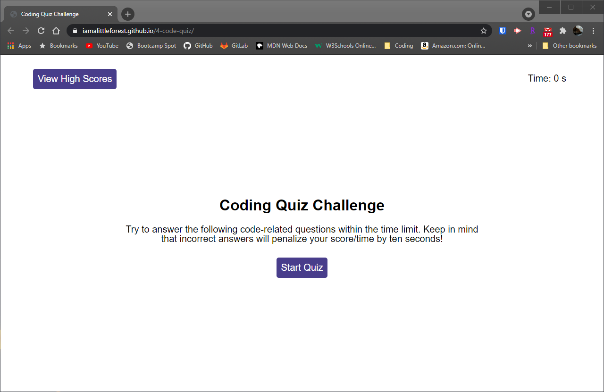

# Code Quiz

## Link
https://iamalittleforest.github.io/4-code-quiz/

## Languages & Technologies 
* HTML
* CSS
* Javascript

## Description
This application enables users to complete a timed coding quiz with multiple-choice questions. Once the quiz has been completed, the user can compare their results to others who have also taken the quiz. This application runs in the browser and features dynamically updated HTML and CSS that is powered by Javascript.

## Screenshot

## Demo

## License
MIT License

## Contact Information
Wendy Kobayashi (<wykobayashi@gmail.com>)